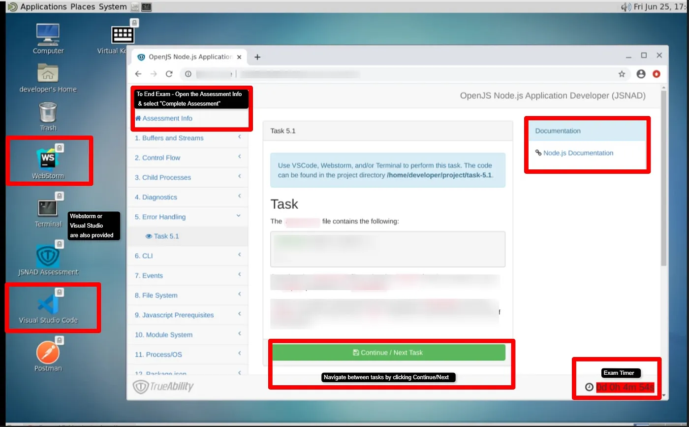

# JSNAD

My personal preparation guide for the exam JSNAD (JavaScript Node Application Developer)

The preparation is based on *v20.11.0* of node

## Exam Details

- This exam is an online, proctored, performance-based test that requires implementing multiple solutions within a Remote Desktop Linux environment.
- The exams are expected to take 2 hours to complete
- The exams are proctored remotely via streaming audio, video, and screen sharing feeds.

## Exam Environment (workstation)

A dedicated environment will be provisioned for your assessment, which will include the following nodes and software:

- Workstation (the VM) is Ubuntu 20.04 based

- GNOME Desktop Environment

- Code Editing Software (VSCode, Vim, WebStorm (*sponsored by JetBrains*)

- API/REST Client (Postman)

- Node.js Version 20 LTS*

  > Note: Copy/Paste via keyboard does not always work and is a limitation of accessing VNC via browser. You can, however, copy/paste using the mouse (right-click). 
  
  

